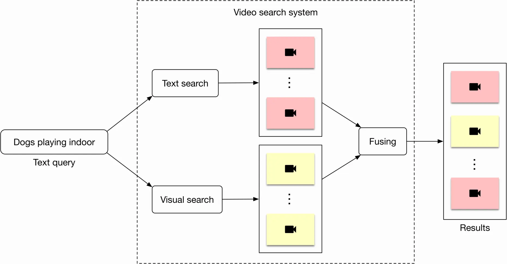
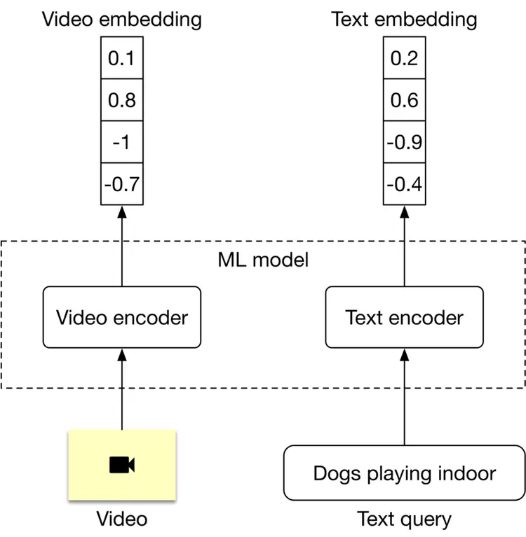
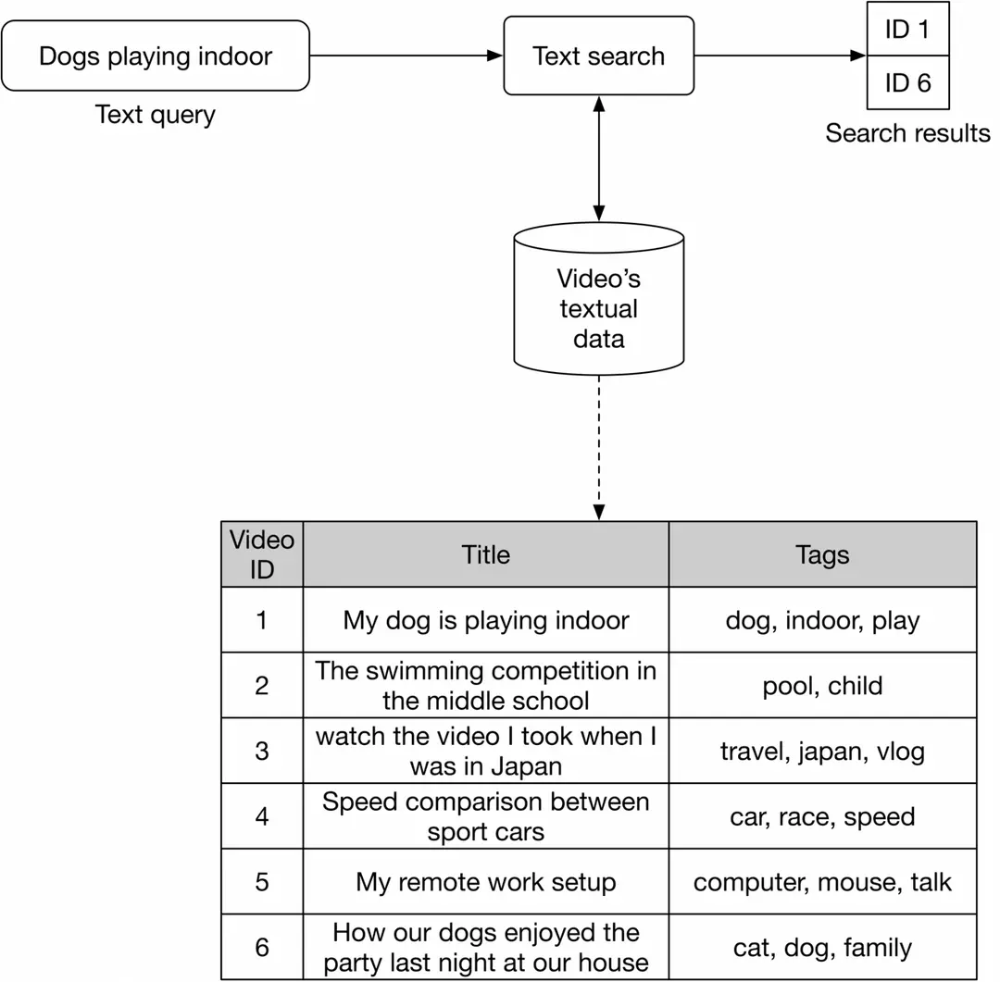
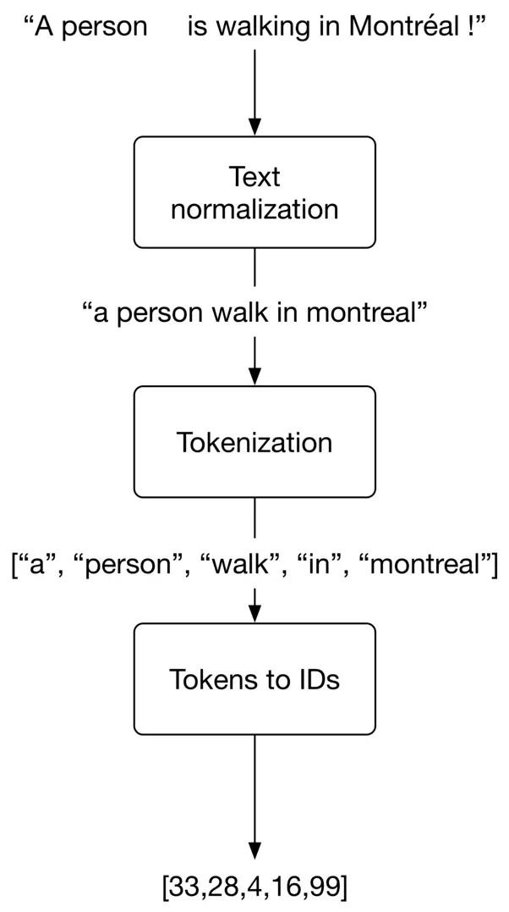

> On video-sharing platforms such as YouTube, the number of videos can quickly grow into the billions.We will design a video search system that can efficiently handle this volume of content.

## Objective 
We are asked to design a search system for videos. The input is a text query, and the output is a list of videos that are relevant to the text query. To search for relevant videos, we leverage both the videos' visual content and textual data. We are given a dataset of ten million ⟨ video, text query ⟩ pairs for model training.

## Problem as a Machine Learning Problem

Users expect search systems to provide relevant and useful results. One way to translate this into an ML objective is to rank videos based on their relevance to the text query.

Now in order to find the relevance between a video and input query we will utilize both the visual content and the textual data of the video like description title, tags, etc.

Lets talk about each component of the system in detail.

### Visual Search

In this component input text query is given and output list of videos are provided. Now these videos are ranked based  on their similarity to the input query.

In this approach, text query and video are encoded separately using two encoders.

The ML model contains a video encoder that generates an embedding vector from the video, and a text encoder that generates an embedding vector from the text. The similarity score between the video and the text is calculated using the dot product of their representations.

### Textual Search

Below figure shows how text search works when a user types in a text query: "dogs playing indoor". Videos with the most similar titles, descriptions, or tags to the text query are shown as the output.

The inverted index is a common technique for creating the text-based search component, allowing efficient full-text search in databases. Since inverted indexes aren't based on machine learning, there is no training cost. A popular search engine companies often use is Elasticsearch, which is a scalable search engine and document store.

## Data Preparation

### Data Engineering
We are given an annotated dataset to train and evaluate the model, it's not necessary to perform any data engineering.

Video Name | Query | Split type
--- | --- | ---
video1 | query1 | train
video2 | query2 | train
video3 | query3 | validation
video4 | query4 | test

### Feature engineering
Almost all ML algorithms accept only numeric input values. Unstructured data such as texts and videos need to be converted into a numerical representation during this step. Let's take a look at how to prepare the text and video data for the model.

**Preparing Text Data**

Text is typically represented as a numerical vector using three steps: text normalization, tokenization, and tokens to IDs.

**Text normalization**

Text normalization - also known as text cleanup - ensures words and sentences are consistent. For example, the same word may be spelled slightly differently; as in "dog", "dogs", and "DOG!" all refer to the same thing but are spelled in different ways. The same is true for sentences. Take these two sentences, for example:

"A person walking with his dog in Montréal !"
"a person walks with his dog, in Montreal."
Both sentences mean the same, but have differing punctuation and verb forms. Here are some typical methods for text normalization:

- Lowercasing: make all letters lowercase, as this does not change the meaning of words or sentences
- Punctuation removal: remove punctuation from the text. Common punctuation marks are the period, comma, question mark, exclamation point, etc.
- Trim whitespaces: trim leading, trailing, and multiple whitespaces
- Normalization Form KD (NFKD) [3]: decompose combined graphemes into a combination of simple ones
- Strip accents: remove accent marks from words.
- Lemmatization and stemming: identify a canonical representative for a set of related word forms.

**Tokenization**

Tokenization is the process of breaking down a piece of text into smaller units called tokens. Generally, there are three types of tokenization:

- Word tokenization: split the text into individual words based on specific delimiters. For example, a phrase like "I have an interview tomorrow" becomes [ "I", "have", "an", "interview", "tomorrow"]
- Subword tokenization: split text into subwords (or n-gram characters)
- Character tokenization: split text into a set of characters The details of different tokenization algorithms are not usually a strong focus in ML system design interviews. If you are interested to learn more, refer to [4].

## References
- [YouTube Video Search](https://bytebytego.com/courses/machine-learning-system-design-interview/youtube-video-search)